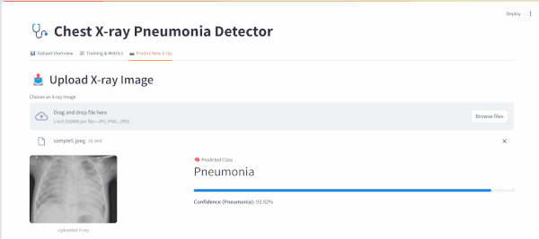

# Pneumonia Detection with Grad-CAMs




A deep learning project for detecting pneumonia from chest X-ray images, featuring model interpretability with Grad-CAMs and deployment via FastAPI and Streamlit.

## Features

- **Pneumonia Detection**: Classifies chest X-rays as Normal or Pneumonia with high accuracy
- **Model Interpretability**: Uses Grad-CAM (Gradient-weighted Class Activation Mapping) to visualize areas of interest
- **Dual Deployment**:
  - **FastAPI**: Robust backend service with RESTful API
  - **Streamlit**: User-friendly web interface for easy interaction
- **Model**: Densenet121 with Transfer Learning
- **Dataset**: Chest X-ray images from huggingface

## Technologies Used

- **Deep Learning**: PyTorch
- **Model Interpretability**: Grad-CAM
- **Backend**: FastAPI
- **Frontend**: Streamlit
- **Image Processing**: OpenCV, PIL
- **Utilities**: NumPy, Pandas

## Installation

1. Clone the repository:

   ```
   git clone https://github.com/yourusername/pneumonia-detection.git
   cd pneumonia-detection
   ```

2. Create and activate a virtual environment:

   ```
   python -m venv venv
   source venv/bin/activate
   ```

3. Install dependencies:
   ```
   pip install -r requirements.
   ```

## Usage

### Running the FastAPI Backend

    ```
       fastapi dev main.py
    ```
    The API will be available at http://localhost:8000. Visit http://localhost:8000/docs for interactive API documentation.

### Running the Streamlit Frontend

    ```
        streamlit run app/main.py
    ```
    The Streamlit app will open in your default browser at http://localhost:8501.

### API Endpoints

    POST /predict: Accepts an X-ray image and returns prediction with Grad-CAM visualization.

## Model Performance Metrics

### Primary Metrics

- **Accuracy**: 0.9966 (99.66%)
- **Balanced Accuracy**: 0.9966 (99.66%)
- **ROC AUC**: 0.9999
- **PR AUC**: 0.9999

### Classification Metrics

- **Matthew's Correlation Coefficient**: 0.9932
- **Cohen's Kappa**: 0.9932

### Clinical Metrics

- **Sensitivity (Recall)**: 0.9974 (99.74%)
- **Specificity**: 0.9957 (99.57%)
- **PPV (Precision)**: 0.9974 (99.74%)
- **NPV**: 0.9957 (99.57%)

### Likelihood Ratios

- **Positive LR**: 233.40
- **Negative LR**: 0.0026

## Acknowledgments

- Dataset providers
- Open-source community for various libraries used

**Note**: This is a research project and not intended for clinical use. Always consult a medical professional for health-related decisions.
